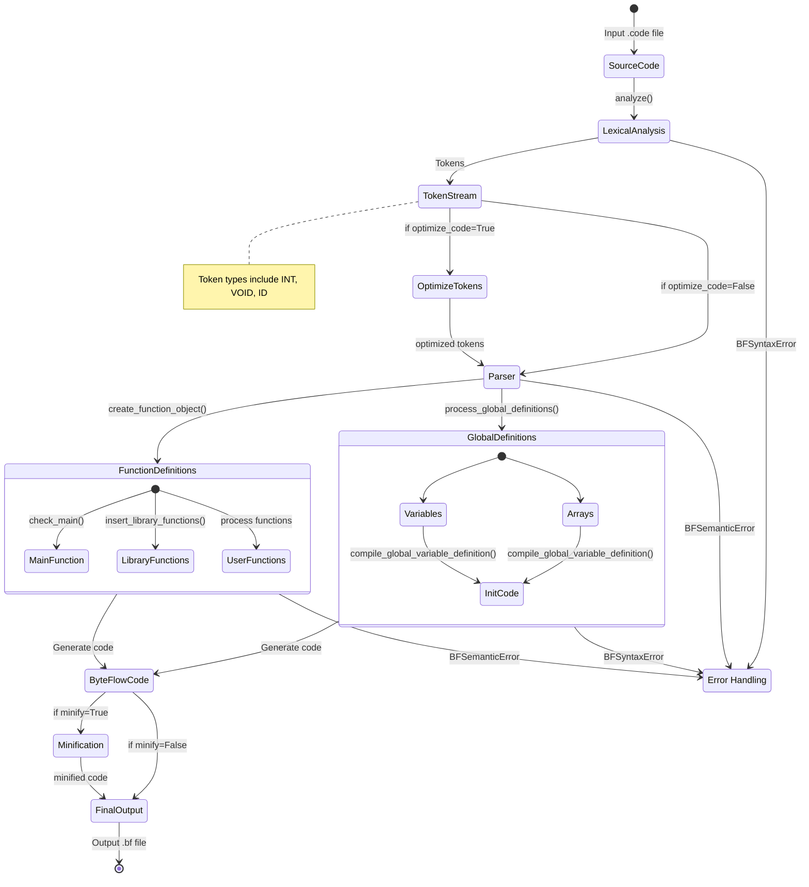

# ByteFlow Compiler

<div align="center">
  
  
  
</div>

ByteFlow Compiler is a robust and innovative compiler implementation for the ByteFlow programming language, developed as part of a Compiler Design course assignment. Unlike traditional compilers that use standard intermediate representations (IR) like Three-Address Code (TAC) or LLVM IR, ByteFlow takes a unique approach by leveraging Turing Machine concepts, inspired by the Brainfuck language, to process and execute code. We designed both the source language and the execution model from scratch, ensuring full control over the compilation pipeline, including lexical analysis, parsing, optimization, and code generation. Instead of generating traditional machine code or assembly, our compiler produces target code that runs on a custom execution model, managing memory as an infinite tape with pointer-based operations. This project not only explores compiler design principles but also challenges conventional paradigms by redefining how code transformation and execution can be approached.

## 🚀 Features

- **C-like Syntax**: Familiar syntax for developers with C/C++ background
- **Rich Language Features**:
  - Basic data types (int, bool, char)
  - Control structures (if-else, loops, switch-case)
  - Functions with parameters
  - Arrays and complex expressions
  - Input/output operations
- **Optimization**: Built-in code optimization capabilities
- **Error Handling**: Comprehensive error detection and reporting
- **Example Programs**: Various sample programs demonstrating language features

## 📋 Table of Contents

- [Installation](#installation)
- [Usage](#usage)
- [Project Structure](#project-structure)
- [Language Syntax](#language-syntax)
- [Examples](#examples)
- [Contributing](#contributing)
- [Team](#team)
- [License](#license)

## 🔧 Installation

1. Clone the repository:
```bash
git clone https://github.com/yourusername/byteflow-compiler.git
cd byteflow-compiler
```

2. Ensure you have Python 3.x installed
3. No additional dependencies required!

## 💻 Usage

To compile a ByteFlow program:

```bash
python byteflow.py <input_file.code> [options]
```

Options:
- `-o, --optimize`: Enable code optimization
- `-v, --verbose`: Enable verbose output
- `-h, --help`: Show help message

To run a compiled program:
```bash
python Interpreter.py <compiled_file.bf>
```

## 📁 Project Structure

```
byteflow-compiler/
├── Compiler/
│   ├── Lexical_analyzer.py   # Tokenization
│   ├── Parser.py            # Syntax analysis
│   ├── FunctionCompiler.py  # Function compilation
│   ├── Optimizer.py        # Code optimization
│   └── ...
├── examples/
│   ├── calc.code           # Calculator example
│   ├── arrays.code         # Array operations
│   ├── bitwise.code        # Bitwise operations
│   └── games/              # Game examples
├── byteflow.py             # Main compiler entry
├── Interpreter.py          # ByteFlow interpreter
└── README.md
```


## 🔄 Transition Diagram

Below is the **state transition diagram** representing the compilation process of ByteFlow, from source code to execution:



## 🔤 Language Syntax

### Basic Program Structure
```c
int main() {
    // Your code here
    return 0;
}
```

### Data Types
- `int`: Integer values
- `bool`: Boolean values (true/false)
- `char`: Character values
- `void`: For functions with no return value

### Control Structures
```c
// If-else
if (condition) {
    // code
} else {
    // code
}

// Loops
while (condition) {
    // code
}

for (init; condition; increment) {
    // code
}

// Switch
switch (value) {
    case 1: // code; break;
    default: // code;
}
```

## 📝 Examples

### Calculator Program
```c
int main() {
    print("Enter two numbers: ");
    int a = readint();
    int b = readint();
    print("Sum is: ");
    printint(a + b);
    return 0;
}
```

More examples can be found in the `examples/` directory.

## 🤝 Contributing

1. Fork the repository
2. Create your feature branch (`git checkout -b feature/amazing-feature`)
3. Commit your changes (`git commit -m 'Add some amazing feature'`)
4. Push to the branch (`git push origin feature/amazing-feature`)
5. Open a Pull Request

## 👥 Team

- **Shubhankar (122CS0047)** - *Core Compiler Implementation*
- **Vikas (122CS0079)** - *Lexer, Parser and Optimization*
- **Edukondulu (122CS0074)** - *Library functions and Examples*

Project developed as part of the Compiler Design course assignment.

## 📄 License

This project is licensed under the MIT License - see the [LICENSE](LICENSE) file for details.

## 🙏 Acknowledgments

- Thanks to our course instructor for guidance
- Inspired by modern compiler design principles
- Built with love for programming language theory
